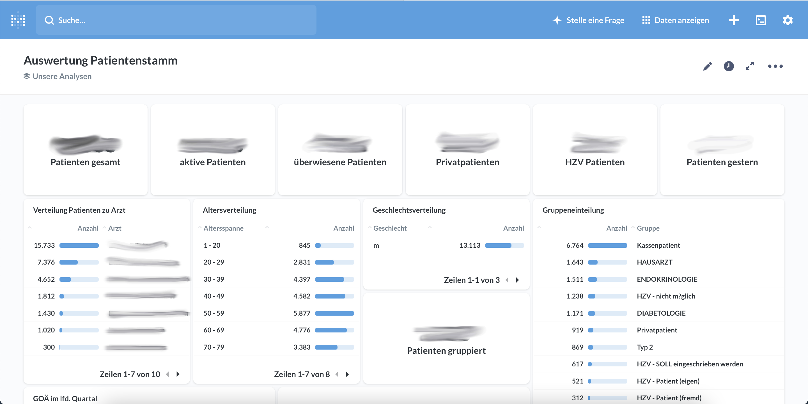
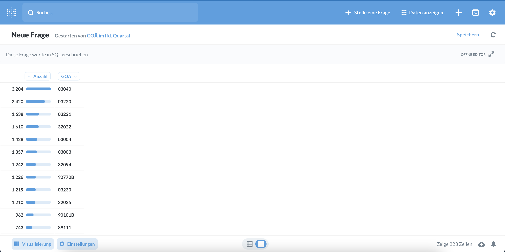

# CGM ALBIS DBase to MariaDB

PHP based script to migrate CGM ALBIS DBase database into a MySQL/MariaDB database for doing analytics with [Metabase].
Alternative an shell script with Debian using package dbf2mysql.

The latest stable version is: **```1.0.0```**

## Usage

Configure settings in config.php. Create cron for copying and doing import.






## Dependencies

 - [dbase2mysql] Migrate DBF files to MySql database
 - [dbf2mysql] This script imports DBASE/FoxPro files, located in a subdir, into a MySQL database. 
 - [php-xbase] A simple library for dealing with dbf databases like dBase and FoxPro. 


## License

MIT

[dbase2mysql]: <https://github.com/jrholowka/dbase2mysql>
[dbf2mysql]: <https://github.com/doofpot/DBFToMySQL>
[php-xbase]: <https://github.com/hisamu/php-xbase>
[Metabase]: <https://www.metabase.com>
